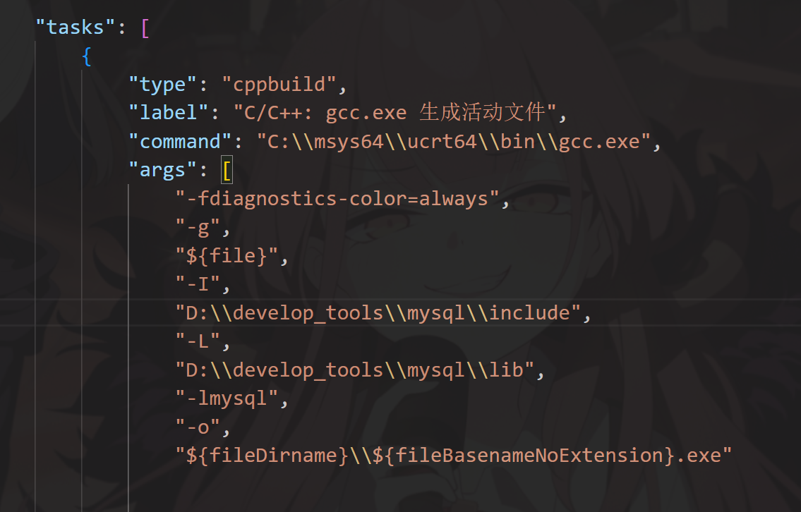
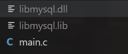

# Student Information Management
## 项目介绍
* 通过c语言完成Student Information Management
* 该程序使用vscode，通过c语音与MYSQL数据库交互，对学生信息进行储存和读取。
* 该程序是大学程序课的课堂作业，本应该用c语言中fread和fwrite完成的，但老师额外提了一句使用其他没学过的工具能额外加分，于是有了用MySQL的想法。~~而且网络上没有找到现成的c代码只能自己动手做~~
* 在基础了解了MySQL的用法后，自信满满以为能立刻上手完成这个项目，结果在编译器和链接器上都花了好久时间（后续我会发遇到的问题分享出来，给大家看个乐子）
* 本人是一名大一新生，才接触编程不久，做这个项目之前只是听说过MySQL的程度，让程序跑起来我就很满足了。
## 分享遇到的困难
* 编译器和链接器方面
   * 没有<mysql.h>:
  在.vscode中的tasks.json中通过'-I'指定编译器查找头文件,'-L'指定链接器查找库文件的目录 
  
  * 还是无法调用库函数：把.dll和.lib放在程序目录
  
* MySQL操作方面
  * 把数据存入数据库一开始只知道`insert into`,但这样存在重复数据的情况，在网上查找了解到使用`replace into`,但实操下来该重复还是重复，才知道要有主键或者唯一性约束`id INT UNIQUE`，虽然不明白具体作用，但大概知道是从约束的那一列里对比是否有重复的
  * 从数据库取数据更是一个困难，我完全看的[别人的代码](https://blog.csdn.net/m0_64280701/article/details/132788701)一点点理解才写出来的,感谢分享的教程让我顺利完成学校的作业。

  
